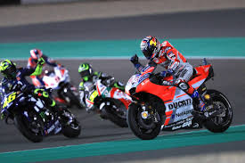

<html>
<head> 
    
 <link rel = "stylesheet" type = "text/css" href = "style.css"/>
 </head>
 <body>
 

 
 
<h2>The Good Stuff</h2>
 

 

  

   <h3>Navigation</h3>
   <ul>
    <li><a class="selected" href="index.html">Home</a></li>
       <li><a href="aboutme.html">About</a></li>
    <li><a href="project.html">Project</a></li>
   </ul>
  

    

    
 
<b>Personal Information:</b> 
Name: Lee111 
Student ID: S3770851 
Email address: <a href="S3770851@student.rmit.edu.au">S3770851@student.rmit.edu.au</a> 
Big Five Personality Score: <a href="https://bigfive-test.com/result/5c7e19372a70890053b9080e">Click Here</a> 
Personality Perfect test: <a href="https://www.personalityperfect.com/istj-the-inspector-premium-profile/">Click Here</a> 
Human Metrics Personality Score: <a href="http://www.humanmetrics.com/personality/intj-type?EI=-16&SN=-25&TF=41&JP=59">Click Here</a> 

    
 
 
 

    
 
    
 
While the results of the above tests vary somewhat, I feel that most of it well describes me. I don’t think the results will change my behaviour within a team environment. I am adaptable and will flex to any line of thought the team may be taking.

Background: New Zealand born Australian Citizen, my education to date is limited.  

Previous studies at TAFE, diploma of management various other training courses (mainly work stuff). 
I would have to say that life experience has been my constant teacher to date. I have worked from the ground up in my early years to a senior role in management over my career. 
I have an interest in golf, motorcycles and in my spare time I also like to sketch and airbrush. 
My favourite sport would be hands down <a href="http://www.motogp.com/"><b>MOTO GP.</b></a>

 
 

<b>What i expect to learn during my studies?</b>

So far, I have already learned more than I could have thought possible in such a short amount of time. My programming knowledge of Java has developed rather quickly and I’m extremely excited to continue learning not only Java but all other areas too. I don’t expect to become a fully-fledged developer overnight without the hard work and screen time but I do expect that I will know enough to begin my journey confidently and grow from there.

   

 Copyright &copy; 2019 Lee111
 

</html>
